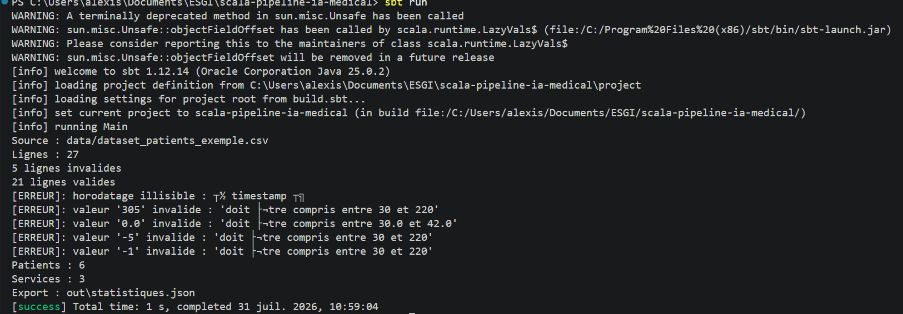
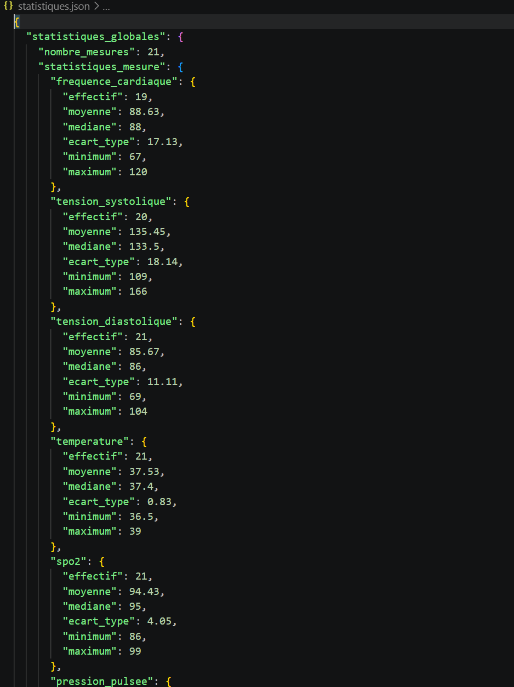
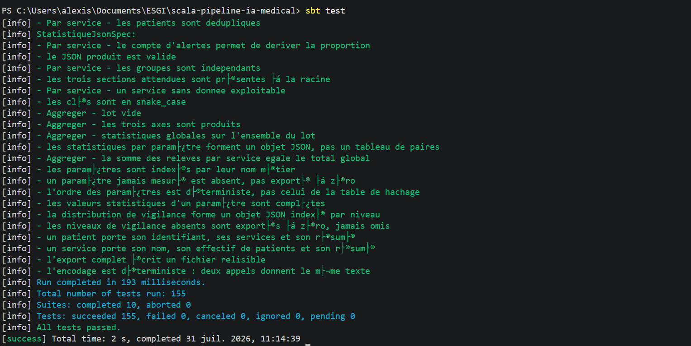

# Pipeline IA médicale en Scala

**Rapport de projet tutoré (Sujet 1)**

Équipe : Alexis GODARD, Emeric SAUTHIER, Thomas SAYEN
Scala 3.3.1 / sbt 1.12.14 / upickle 3.3.1 / ScalaTest 3.2.19

---

## 1. Contexte et objectif

Un service de chirurgie équipe chaque lit d'un moniteur de chevet qui relève toutes les 15 minutes la fréquence cardiaque, la tension artérielle, la température et la SpO2 des patients en suivi post-opératoire. Ces relevés sont exportés dans un CSV brut qui contient les défauts classiques d'un flux capteur réel : valeurs manquantes (capteur débranché), valeurs aberrantes (glitch matériel, par exemple 305 bpm ou 0.0 °C) et doublons (resynchronisation réseau du moniteur).

L'objectif est de construire un pipeline de traitement écrit en programmation fonctionnelle, qui lit ces relevés, les fiabilise, les enrichit d'indicateurs cliniques, calcule des statistiques descriptives par patient et par service, puis exporte un rapport JSON exploitable par un tableau de bord infirmier.

Le flux retenu est le suivant :

```
Collecte  ->  Nettoyage  ->  Transformation  ->  Agrégation  ->  Export
 (I/O)        (pur)           (pur)              (pur)          (I/O)
```

Le point structurant du projet est la séparation *functional core, imperative shell* : seules la première et la dernière étape touchent au disque, tout le reste est composé de fonctions pures manipulant des collections immuables. Sur des données de santé, cette contrainte n'est pas cosmétique : elle garantit qu'aucune mesure source n'est modifiée en place, donc que le traitement est rejouable et auditable.

---

## 2. Arborescence du projet

```
scala-pipeline-ia-medical/
├── build.sbt                        Configuration sbt (Scala 3.3.1, upickle, ScalaTest, encodage UTF-8)
├── project/
│   ├── Dependencies.scala           Déclaration centralisée des dépendances
│   └── build.properties             Version de sbt
├── data/
│   ├── dataset_patients_exemple.csv Jeu de données d'exemple fourni (27 lignes)
│   └── exmemple_donnees.xlsx
├── out/
│   └── statistiques.json            Rapport JSON produit par le pipeline
├── docs/
│   ├── RAPPORT.md                   Le présent rapport
│   └── captures/                    Captures d'écran des résultats
├── README.md                        Cadrage, modélisation, répartition des rôles
└── src/
    ├── main/scala/
    │   ├── Main.scala               Point d'entrée : ordonnancement des 5 étapes
    │   ├── Nettoyer.scala           Parsing et nettoyage (package clean)
    │   ├── domain/                  Modèle métier, 100 % immuable
    │   │   ├── Mesure.scala                 case class d'un relevé brut
    │   │   ├── MesureTransformee.scala      Relevé enrichi (indicateurs dérivés + vigilance)
    │   │   ├── ObservationMesure.scala      Vigilance paramètre par paramètre
    │   │   ├── IndicateurVigilance.scala    sealed trait Normal/Surveillance/Alerte + seuils
    │   │   ├── Statistique.scala            Structures de résultats + ADT ParametreMesure
    │   │   └── Erreurs.scala                ADT ErreurParsing et ErreurPipeline
    │   ├── pipeline/                Cœur fonctionnel, aucune I/O
    │   │   ├── Classification.scala         Mesure -> niveaux de vigilance
    │   │   ├── Transformation.scala         Indicateurs dérivés + enrichissement
    │   │   └── Aggregation.scala            Statistiques globales / patient / service
    │   └── storage/                 Couche I/O, seule autorisée aux effets de bord
    │       ├── LecteurCsv.scala             Lecture disque (unique entrée)
    │       ├── EcrivainFichier.scala        Écriture disque (unique sortie)
    │       ├── EcrivainJson.scala           Encodage, validation, export
    │       ├── JsonFormat.scala             Configuration de sérialisation upickle
    │       └── Diagnostic.scala             Traduction des exceptions système
    └── test/scala/
        ├── domain/
        │   ├── IndicateurVigilanceSpec.scala
        │   └── ParametreMesureSpec.scala
        ├── pipeline/
        │   ├── NeettoyerSpec.scala
        │   ├── ClassificationSpec.scala
        │   ├── TransformationSpec.scala
        │   └── AggregationSpec.scala
        └── storage/
            ├── LecteurCsvSpec.scala
            ├── EcrivainFichierSpec.scala
            ├── EcrivainJsonSpec.scala
            └── StatistiqueJsonSpec.scala
```

Le découpage suit les couches demandées : `domain` porte les types, `pipeline` porte les fonctions pures, `storage` isole les effets de bord, et `Main` se contente d'enchaîner les appels.

---

## 3. Architecture et choix techniques

### 3.1 Modélisation du domaine

Un relevé brut est une `case class` dont tous les champs capteur sont des `Option` :

```scala
case class Mesure(
    patientId: String,
    timestamp: LocalDateTime,
    service: String,
    age: Int,
    frequenceCardiaque: Option[Int],
    tensionSystolique: Option[Int],
    tensionDiastolique: Option[Int],
    temperature: Option[Double],
    spo2: Option[Int]
)
```

Le choix de `Option` est ce qui permet de distinguer les deux cas que le sujet demande de traiter différemment : un capteur débranché produit `None` et la mesure est conservée, alors qu'une valeur hors plage physiologique fait rejeter la ligne entière.

Le niveau de vigilance est un `sealed trait` à trois variantes, muni d'une sévérité entière et d'un `Ordering` dérivé de cette sévérité :

```scala
sealed trait IndicateurVigilance { def severite: Int }
object IndicateurVigilance {
    case object Normal extends IndicateurVigilance { val severite = 0 }
    case object Surveillance extends IndicateurVigilance { val severite = 1 }
    case object Alerte extends IndicateurVigilance { val severite = 2 }
    given Ordering[IndicateurVigilance] = Ordering.by(_.severite)
}
```

Cet `Ordering` sert directement à calculer la vigilance globale d'un relevé : c'est le maximum des vigilances de chaque paramètre observé (`observations.maxOption` dans `ObservationMesure`). Un patient dont un seul paramètre est en alerte est donc en alerte, ce qui est le comportement clinique attendu.

Les erreurs sont elles aussi modélisées par des ADT (`ErreurParsing`, `ErreurPipeline`) plutôt que par des chaînes libres : chaque variante porte ses données (numéro de ligne, valeur fautive, motif) et calcule son propre message.

### 3.2 Lecture et nettoyage

`LecteurCsv.lire` est volontairement minimaliste : il ouvre le fichier en UTF-8 explicite et rend une `List[String]`. Il n'interprète rien, ne découpe pas les colonnes, ne filtre pas. Toute défaillance système est convertie en `Left(ErreurPipeline.LectureImpossible)`, aucune exception ne sort de la couche.

`Nettoyer` prend le relais côté fonctions pures. Chaque champ a sa fonction de lecture qui renvoie un `Either[ErreurParsing, _]`, et ces fonctions sont assemblées par une `for`-comprehension qui court-circuite à la première erreur :

```scala
def lireMesure(ligneCSV: String, i: Int): Either[ErreurParsing, Mesure] =
    ligneCSV.split(",") match
        case Array(patientId, timestamp, service, age, fc, sys, dia, temp, spo2) =>
            for {
                _patientId <- lirePatientId(i, patientId)
                _timestamp <- lireTimestamp(i, timestamp)
                ...
            } yield Mesure(...)
        case err => Left(ErreurParsing.NombreDeChampsInvalide(i, 9, err.size))
```

La validation des plages est factorisée dans une seule fonction générique `lireCapteur[T]`, paramétrée par les bornes et un convertisseur, avec une contrainte de contexte `using Ordering[T]`. Les cinq capteurs ne sont ensuite qu'une ligne chacun :

```scala
def lireFrequenceCardiaque(i: Int, v: String) = lireCapteurInt(i, v, "Fréquence cardiaque", 30, 220)
def lireTemperature(i: Int, v: String)        = lireCapteurDouble(i, v, "Température", 30, 42)
```

Le rapport de nettoyage est une valeur retournée et non un affichage : `lireMesures` rend un couple `(List[ErreurParsing], List[Mesure])` obtenu par `partitionMap(identity)`. La déduplication est faite ensuite par un `foldLeft` qui ne conserve une mesure que si aucune du même `patientId` et du même `timestamp` n'est déjà dans l'accumulateur.

### 3.3 Transformation et classification

`Classification` traduit chaque valeur en niveau de vigilance par pattern matching sur des gardes, à partir des seuils centralisés dans l'objet `SeuilsVigilance` :

```scala
def classerFrequenceCardiaque(freq: Int): IndicateurVigilance = freq match {
    case v if v <  FrequenceCardiaque.alerteBasse     => Alerte
    case v if v <  FrequenceCardiaque.normalMin       => Surveillance
    case v if v <= FrequenceCardiaque.normalMax       => Normal
    case v if v <= FrequenceCardiaque.surveillanceMax => Surveillance
    case _                                            => Alerte
}
```

Les seuils étant isolés dans un objet dédié, les faire évoluer ne demande de toucher ni à la logique de classement ni aux tests de structure.

`Transformation` calcule deux indicateurs dérivés via des `for`-comprehensions sur `Option`, ce qui propage naturellement l'absence de mesure sans un seul test de nullité :

```scala
def pressionPulsee(mesure: Mesure): Option[Int] =
    for {
        systolique  <- mesure.tensionSystolique
        diastolique <- mesure.tensionDiastolique
    } yield systolique - diastolique
```

Le résultat est une `MesureTransformee` qui **encapsule** la `Mesure` d'origine sans la modifier, et lui adjoint la pression pulsée, la pression artérielle moyenne, l'observation par paramètre et la vigilance globale. La mesure source reste donc lisible telle quelle en aval, ce qui est exactement la propriété de traçabilité recherchée.

### 3.4 Agrégation

Les statistiques sont calculées en un seul passage par un `foldLeft` sur un accumulateur immuable, sans aucune variable mutable :

```scala
private final case class Accumulateur(effectif: Int, somme: Double, sommeCarres: Double,
                                      minimum: Double, maximum: Double) {
    def ajouter(valeur: Double): Accumulateur = Accumulateur(
        effectif + 1, somme + valeur, sommeCarres + valeur * valeur,
        Math.min(minimum, valeur), Math.max(maximum, valeur)
    )
}
```

Effectif, moyenne, écart-type, minimum et maximum en découlent directement ; la médiane demande un tri séparé, seule statistique qui ne se calcule pas en flux.

La généralisation à tous les paramètres passe par l'ADT `ParametreMesure`, dont chaque `case object` sait extraire sa propre valeur d'une `MesureTransformee`. Ajouter un paramètre statistique revient donc à ajouter un `case object` et à l'inscrire dans la liste `parametres` : ni `Aggregation` ni `JsonFormat` n'ont à changer.

Les trois axes demandés sont produits par `aggreger` : statistiques globales, statistiques par patient et statistiques par service, ces deux dernières obtenues par `groupBy` puis application de la même fonction `calculerResumeStatistique`. Chaque résumé contient la distribution des vigilances, initialisée à `Map(Normal -> 0, Surveillance -> 0, Alerte -> 0)` pour qu'aucune clé ne manque jamais côté tableau de bord. La proportion de mesures en alerte par service s'en déduit immédiatement.

### 3.5 Export JSON

L'export se fait en trois temps dont deux purs, chaînés par une `for`-comprehension sur `Either` :

```scala
def exporter[A](chemin: String, valeur: A)(implicit ecrivain: JsonFormat.Writer[A]) = {
    val json = encoder(valeur)
    for {
        _     <- valider(json)
        ecrit <- EcrivainFichier.ecrire(chemin, json)
    } yield ecrit
}
```

L'ordre est ce qui garantit qu'un document mal formé n'atteint jamais le disque : `valider` relit le texte produit avec `ujson.read`, et le court-circuit du `Either` annule l'écriture en cas d'échec. `EcrivainFichier` est le seul point d'écriture du programme ; il crée les dossiers parents manquants et impose UTF-8.

`JsonFormat` centralise trois réglages de sérialisation qui bénéficient à tous les types :

- `Option[T]` est écrit en `null` plutôt qu'en tableau vide, pour qu'un capteur débranché n'apparaisse pas comme `"frequence_cardiaque": []` ;
- les clés `camelCase` de Scala sont converties en `snake_case`, comme les colonnes du CSV source ;
- les `Map` dont la clé est un ADT sont écrites en objets JSON indexés par nom, et non en tableaux de paires comme le ferait upickle par défaut. Le parcours de la liste canonique `ParametreMesure.parametres` rend en prime l'ordre des clés déterministe, donc les diffs de JSON lisibles.

---

## 4. Principes fonctionnels appliqués

| Principe | Où il est mis en œuvre |
|---|---|
| Immutabilité | `case class` et `List`/`Map`/`Vector` immuables partout, aucun `var` dans le projet |
| Fonctions pures | Tout `pipeline/` et `Nettoyer`, testables sans aucun montage de fichiers |
| Fonctions d'ordre supérieur | `map`, `flatMap`, `filter`, `foldLeft`, `groupBy`, `partitionMap`, `maxOption` |
| Pattern matching et ADT | `IndicateurVigilance`, `ParametreMesure`, `ErreurParsing`, `ErreurPipeline` |
| Erreurs sans exception | `Either` de bout en bout, `Option` pour les mesures absentes, `Try` uniquement à la frontière I/O pour convertir les exceptions système |
| Composition | `for`-comprehensions sur `Either` et `Option`, chaînage explicite dans `Main` |
| Functional core, imperative shell | `storage/` isole lecture et écriture, `Main` ne contient aucune règle métier |

Le seul endroit du programme qui affiche quelque chose est `Main`. Aucune fonction du cœur ne fait de `println` : les diagnostics remontent sous forme de valeurs.

---

## 5. Résultats et captures

### 5.1 Exécution du pipeline

Exécution sur le jeu d'exemple avec `sbt run` :



Sur 27 lignes lues, 5 sont rejetées et 21 relevés valides sont conservés, portant sur 6 patients répartis dans 3 services. Les rejets correspondent exactement aux défauts injectés dans le jeu de données :

| Motif | Valeur | Interprétation |
|---|---|---|
| Horodatage illisible | `timestamp` | Ligne d'en-tête du CSV |
| Valeur hors plage | `305` bpm | Glitch de capteur cardiaque |
| Valeur hors plage | `0.0` °C | Capteur de température défaillant |
| Valeur hors plage | `-5` bpm | Valeur négative impossible |
| Valeur hors plage | `-1` bpm | Valeur négative impossible |

L'écart entre 27 lignes lues, 5 rejets et 21 relevés valides s'explique par le doublon `P001 / 08:45:00`, supprimé par la déduplication après le parsing.

### 5.2 Rapport JSON exporté



Le fichier `out/statistiques.json` contient trois sections : `statistiques_globales`, `statistiques_patients` et `statistiques_services`. On y lit par exemple, au niveau global, une fréquence cardiaque moyenne de 88.63 bpm sur 19 relevés exploitables (deux capteurs étaient débranchés), une température moyenne de 37.53 °C sur 21 relevés, et une SpO2 moyenne de 94.43 %. L'écart d'effectif entre les paramètres est précisément la trace des mesures manquantes conservées.

Chaque section porte aussi sa `distribution_vigilances`, ce qui permet au tableau de bord d'afficher directement la proportion de relevés en alerte par service, et de croiser avec `statistiques_patients` (qui liste les services de chaque patient) pour identifier les patients à prioriser.

### 5.3 Tests



La suite compte **155 tests répartis en 10 suites ScalaTest**, tous au vert. Elle couvre :

- le parsing et le nettoyage : lignes malformées, champs vides, valeurs hors plage, doublons ;
- la classification : chaque seuil est testé sur ses bornes, y compris les cas limites ;
- la transformation : indicateurs dérivés, propagation des `None`, calcul de la vigilance globale ;
- l'agrégation : les trois axes, indépendance des groupes, cohérence entre la somme par service et le total global, lot vide ;
- l'export : validité du JSON produit, clés en `snake_case`, niveaux de vigilance jamais omis, déterminisme de l'encodage (deux appels donnent le même texte).

Les fonctions du cœur étant pures, ces tests s'écrivent sans montage de fichiers temporaires ni mock, ce qui explique la vitesse d'exécution (193 ms).

---

## 6. Difficultés rencontrées

**Sérialisation des `Map` à clé non textuelle.** upickle ne produit un objet JSON que pour les `Map` dont la clé est une `String` ; pour tout autre type il émet un tableau de paires du type `[["spo2", {...}], ...]`, qu'un tableau de bord ne sait pas exploiter. Il a fallu écrire à la main le `Writer` de `ResumeStatistique` et passer par `ujson.Obj.from` pour reprendre le contrôle de la forme produite.

**Ordre d'initialisation des `Writer`.** Un `Writer` dérivé par `macroW` capture les `Writer` de ses champs au moment de son initialisation. Déclarer un type composite avant ses feuilles produit un `NullPointerException` à l'exécution, et non une erreur de compilation. Le diagnostic a été long ; la règle « feuilles avant composites » est désormais documentée directement dans `JsonFormat`.

**Déterminisme du JSON.** Au delà de quatre entrées, une `Map` immuable de Scala est une table de hachage dont l'ordre d'itération n'est pas spécifié. Les diffs de JSON entre deux exécutions devenaient illisibles. La solution retenue est de parcourir la liste canonique `ParametreMesure.parametres` plutôt que la `Map`, ce qui fixe l'ordre des clés et suit l'ordre clinique des paramètres.

**Distinguer manquant et aberrant.** La tentation initiale était de traiter les deux cas de la même façon. La règle finalement retenue est explicite : une valeur absente donne `None` et la ligne est conservée, une valeur hors plage physiologique fait rejeter la ligne entière avec son motif. C'est ce qui explique que les effectifs diffèrent d'un paramètre à l'autre dans le JSON.

**Encodage.** Le projet est développé sous Windows, dont l'encodage JVM par défaut n'est pas UTF-8. Les accents et le caractère `°` étaient corrompus en lecture comme en écriture. UTF-8 est donc imposé explicitement dans `build.sbt` ainsi que dans `LecteurCsv` et `EcrivainFichier`. Les captures de console montrent encore des accents mal rendus, mais il s'agit uniquement de l'affichage du terminal PowerShell : le CSV lu et le JSON écrit sont bien en UTF-8.

**Limites connues.** La ligne d'en-tête du CSV n'est pas retirée avant le parsing : elle est comptabilisée comme une erreur d'horodatage. Le résultat est correct puisque la ligne est bien écartée, mais le rapport de nettoyage annonce une erreur de plus qu'il n'y a de vrais défauts de données. Par ailleurs, `Main` recevrait aujourd'hui une liste vide sans le signaler comme une erreur métier, alors que l'ADT `ErreurPipeline.AucuneLigneExploitable` est prévu pour ce cas.

---

## 7. Organisation de l'équipe

Le travail s'est déroulé à distance sur quatre séances, avec un dépôt GitHub partagé et une branche par fonctionnalité (`nettoyer`, `transformation_donnee`, `statistiques`, `json`), fusionnée par pull request après revue croisée.

| Membre | Périmètre |
|---|---|
| Alexis GODARD | Couche I/O (`LecteurCsv`, `EcrivainFichier`, `EcrivainJson`, `JsonFormat`), intégration finale du `Main`, tests associés |
| Emeric SAUTHIER | Classification, transformation, agrégation, modèle de statistiques, tests associés |
| Thomas SAYEN | Parsing et nettoyage, gestion des erreurs de parsing, déduplication, tests associés |

Le découpage en couches a permis de travailler en parallèle dès la fin de la séance 1 : les types du package `domain` ayant été fixés collectivement, chacun a pu développer contre ces contrats sans attendre les autres. La couche I/O a d'ailleurs été terminée et testée avant même que `Statistique` n'existe, grâce au caractère générique de `EcrivainJson.exporter[A]`, qui accepte n'importe quel type disposant d'un `Writer`.

Le principal coût de coordination a porté sur les conflits de merge autour de `build.sbt` et sur un changement de framework de test en cours de route (migration de munit vers ScalaTest), qui a demandé de reprendre les suites déjà écrites.

---

## 8. Conclusion

Le pipeline traite le jeu de données d'exemple de bout en bout : il écarte les 4 valeurs aberrantes et le doublon présents dans le fichier, conserve les mesures manquantes comme telles, produit les statistiques descriptives sur les cinq paramètres vitaux et les deux indicateurs dérivés, classe chaque relevé en Normal, Surveillance ou Alerte, et exporte un JSON validé exploitable par un tableau de bord.

Les contraintes fonctionnelles du sujet ont été tenues : aucune variable mutable, aucune exception dans le cœur métier, effets de bord confinés à deux fichiers de la couche `storage`, et un modèle de domaine construit sur des ADT et du pattern matching exhaustif. La suite de 155 tests, rendue simple à écrire par la pureté des fonctions, valide chaque étape indépendamment ainsi que leur composition.

Les pistes optionnelles du sujet restent ouvertes : détection de tendances sur plusieurs relevés consécutifs d'un même patient (la structure par patient est déjà en place), parallélisation du calcul des statistiques (les fonctions étant pures, elle est immédiate), et génération d'un tableau de bord HTML en complément du JSON (`EcrivainFichier` étant déjà agnostique du format).
